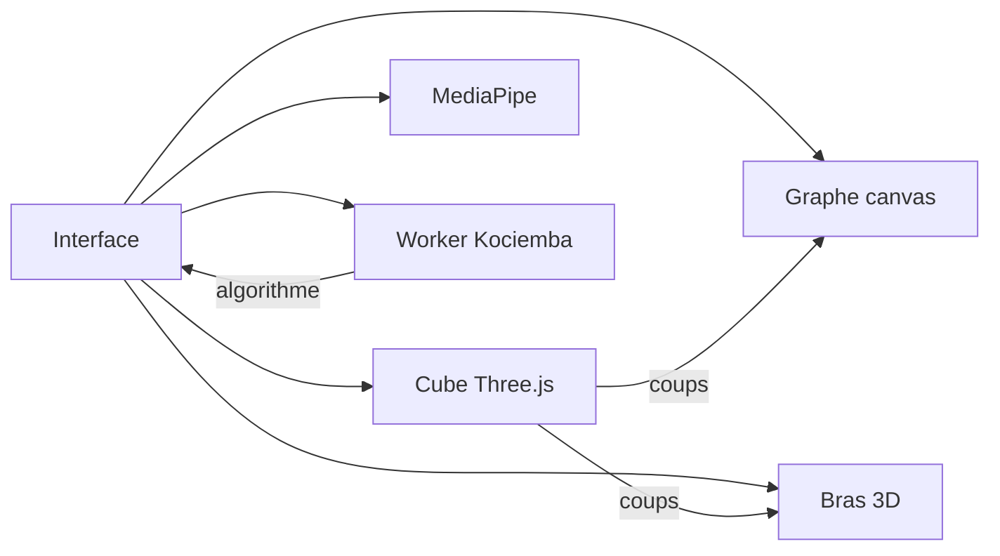

# Rubik Graph

Application web pour **manipuler un Rubik’s Cube en 3D**, **voir ses orbites en théorie des graphes**, **trouver un chemin jusqu’à l’identité** (algorithme de Kociemba) et **le rejouer** — à la souris, au clavier, par gestes webcam, ou avec un bras robot.

Interface en français. Rien à compiler côté serveur : tout tourne dans le navigateur.

```
Cube 3D  ←→  Graphe d’orbites  ←→  Chemin de Cayley  ←→  Bras manipulateur
                souris · clavier · MediaPipe · solveur Kociemba
```

---

## Sommaire

- [Fonctionnalités](#fonctionnalités)
- [Prérequis](#prérequis)
- [Installation](#installation)
- [Lancer l’app](#lancer-lapp)
- [Déploiement](#déploiement)
- [Guide de fonctionnement](#guide-de-fonctionnement)
- [Raccourcis clavier](#raccourcis-clavier)
- [Structure du code](#structure-du-code)
- [Technologies](#technologies)
- [Sources d’inspiration](#sources-dinspiration)

---

## Fonctionnalités

### Cube 3D

- Cube physique en 27 cubies (Three.js), orbites à la souris, zoom à la molette
- Glisser une **facette** pour tourner la couche correspondante (U, R, F, D, L, B)
- Boutons de notation Singmaster : `U` `U'` `R` `R'` `F` `F'` `D` `D'` `L` `L'` `B` `B'`
- **Mélanger** (scramble aléatoire) et **Reset** vers l’état résolu
- Indicateurs : *résolu / mélangé*, nombre de coups, état des gestes

### Théorie des graphes

- Projection des 54 facettes sur des **cercles concentriques** (orbites U / F / R)
- Chaque point = une facette ; les intersections des cercles placent les stickers
- Pendant un coup, les orbites **tournent** (tirets, flèches, secteur d’angle) et les points **glissent** sur leur cercle
- Même idée pédagogique que *Solving a Rubik’s Cube with graph theory*

### Chemin vers l’identité

- Solveur **Kociemba** dans un Web Worker (ne bloque pas l’interface)
- Le chemin s’affiche comme une suite de coups (graphe de Cayley : sommet = configuration, arête = coup)
- Lecture **pas à pas**, **Lire**, **Stop**, barre de progression `n / N`
- Le cube 3D, le graphe et le robot restent synchronisés

### Bras robot

- Onglet **Robot** : studio 3D avec un bras manipulateur qui tient le cube
- Bouton **Le robot résout** : calcule le chemin puis le rejoue sur le bras
- Inspiré de [Dexterous Cube Solving](https://dex-rubik-cube.yanjieze.com/) (Yanjie Ze)

### Gestes webcam

- Détection des deux mains (MediaPipe Hand Landmarker)
- **Main gauche** ouverte : orbiter la caméra · poing : figer l’orbite
- **Main droite** : viser une facette, **pincer** pour tourner la couche
- Bouton **Inverser L/R** si la webcam inverse les mains

---

## Prérequis

| Outil | Version |
| --- | --- |
| [Node.js](https://nodejs.org/) | 20 ou plus (recommandé) |
| npm | fourni avec Node |
| Navigateur | Chrome, Edge ou Firefox récents |

La webcam n’est utile que pour les gestes. Le reste fonctionne sans caméra. Autoriser la caméra uniquement sur `localhost` (ou HTTPS).

---

## Installation

Dans un terminal :

```bash
cd "C:\Users\MEVENGUE Franck\Desktop\rubiks-cube-js\frontend"
npm install
```

Cela installe Vite, Three.js, cubejs (modèle + solveur) et MediaPipe.

Depuis la racine du repo, `npm run dev` lance la même commande dans `frontend/`.

---

## Lancer l’app

**Mode développement** (rechargement à chaud) :

```bash
cd frontend
npm run dev
```

Puis ouvrir **[http://localhost:5173/](http://localhost:5173/)** dans le navigateur.

**Build de production** :

```bash
cd frontend
npm run build
npm run preview
```

`preview` sert le dossier `frontend/dist/` en local pour vérifier le build.

---

## Déploiement

Le repo est séparé en **deux dossiers** : `frontend/` (Vercel) et `backend/` (Railway).

### Vercel — `frontend/`

1. [vercel.com](https://vercel.com) → **Add New** → **Project** → importer le dépôt.
2. **Root Directory** : `frontend`
3. Framework **Vite** (détecté) · Build : `npm run build` · Output : `dist`
4. **Deploy** → URL `*.vercel.app`

Fichier : [`frontend/vercel.json`](./frontend/vercel.json).

### Railway — `backend/`

Railway construit le frontend puis lance le serveur Node de `backend/`. **Ne pas** définir Root Directory (laisser la racine du repo).

1. [railway.app](https://railway.app) → **New Project** → **Deploy from GitHub**.
2. Variables : aucune obligatoire (`PORT` est injecté).
3. Build : le [`Dockerfile`](./backend/Dockerfile), déjà indiqué dans [`railway.toml`](./railway.toml). Node de l’image doit être **22.12 ou plus** (Vite 8).

**Docker** (optionnel), depuis la racine du repo :

```bash
docker build -f backend/Dockerfile -t rubik-graph .
docker run -p 4173:4173 -e PORT=4173 rubik-graph
```

Prod en local (même serveur que Railway) :

```bash
npm run build
npm start
```

→ [http://localhost:4173/](http://localhost:4173/)

---

## Guide de fonctionnement

### 1. Prendre le cube en main

1. À gauche : le cube 3D. Glisser le **fond noir** pour tourner autour, la molette pour zoomer.
2. Glisser une **pastille de couleur** : la couche part dans le sens du geste, puis s’aligne à 90°.
3. Ou cliquer `U`, `R'`, `F2`, etc. dans la barre du bas.
4. **Mélanger** pour un scramble, **Reset** pour revenir à l’identité.

Le panneau de droite suit chaque coup : les points du graphe se déplacent sur leurs orbites.

### 2. Lire le graphe

Onglet **Graphe**.

- Six amas de couleurs = six faces (blanc U, rouge R, vert F, jaune D, orange L, bleu B)
- Un coup met en surbrillance les cercles de la face tournée : rotation visible + traînées des facettes
- C’est la même information que le cube, projetée en 2D

### 3. Résoudre (chemin de Kociemba)

1. Mélanger le cube (ou le déranger à la main).
2. Attendre **Kociemba prêt** à droite (le worker charge au démarrage).
3. Cliquer **Résoudre** dans la barre du bas.
4. Le chemin apparaît sous *Chemin vers l’identité* (souvent ~20 coups).
5. **Lire** pour animer toute la solution, **Pas à pas** pour un coup, **Retour** pour reculer et revoir un coup mal vu, **Stop** pour pauser. Un clic sur un coup du chemin rejoue ce mouvement.

Vert = déjà joué, orange = coup en cours, crème = à venir.

### 4. Faire résoudre le robot

1. Mélanger.
2. Cliquer **Le robot résout** (ou onglet **Robot**, puis le même bouton).
3. Le bras planifie, puis rejoue chaque face. Le libellé **ACTION** indique le coup courant.
4. Lien vers le playground de référence : [dex-rubik-cube.yanjieze.com](https://dex-rubik-cube.yanjieze.com/).

Dans l’onglet Robot, on peut aussi orbiter la scène à la souris.

### 5. Gestes (optionnel)

1. **Activer la caméra** et accepter l’accès.
2. Une vignette *GESTURE CONTROL* s’affiche en haut à gauche du cube.
3. Main **gauche** ouverte : bouger la paume pour orbiter · fermer le poing pour figer.
4. Main **droite** : pointer une facette, pincer pouce–index, glisser pour tourner, relâcher pour valider.
5. Mains inversées ? **Inverser L/R** (ou touche `H`).
6. **Couper la caméra** pour tout arrêter.

---

## Raccourcis clavier

| Touche | Action |
| --- | --- |
| `U` `R` `F` `D` `L` `B` | Quart de tour horaire |
| `Shift` + la même lettre | Quart de tour inverse (`U'`, `R'`, …) |
| `←` | Reculer d’un coup de la solution |
| `→` | Avancer d’un coup de la solution |
| `S` | Mélanger |
| `Z` | Reset |
| `H` | Inverser mains gauche / droite |

Les lettres du cube sont celles du clavier, pas de la disposition AZERTY des symboles : la touche **U** déclenche `U`, même en AZERTY.

---

## Structure du code

```
rubiks-cube-js/
├── frontend/                 # → Vercel (Root Directory = frontend)
│   ├── index.html
│   ├── src/
│   │   ├── main.ts           # orchestration (cube, graphe, robot, solveur, gestes)
│   │   ├── style.css
│   │   ├── cube/             # modèle cubejs + rendu Three.js
│   │   ├── graph/            # layout d’orbites + animation canvas 2D
│   │   ├── robot/            # bras 3D + mini-cube
│   │   └── gestures/         # MediaPipe Hand Landmarker
│   ├── public/
│   │   ├── solver-worker.js  # Kociemba dans un worker
│   │   └── vendor/           # cube.js + solve.js
│   ├── vercel.json
│   └── package.json
├── backend/                  # → Railway (serveur Node)
│   ├── server.mjs            # sert frontend/dist sur 0.0.0.0:$PORT
│   ├── Dockerfile
│   └── package.json
├── railway.toml
└── package.json              # build frontend + start backend
```



---

## Technologies

| Pièce | Choix |
| --- | --- |
| Bundler | [Vite 8](https://vite.dev/) |
| Langage | [TypeScript](https://www.typescriptlang.org/) |
| 3D | [Three.js 0.186](https://threejs.org/) |
| Modèle / solveur | [cubejs](https://github.com/ldez/cubejs) (Kociemba) |
| Gestes | [MediaPipe Tasks Vision 1.0.1](https://ai.google.dev/edge/mediapipe/solutions/vision/hand_landmarker) |
| Notation | Singmaster `URFDLB` |

---

## Sources d’inspiration

Ce projet n’est pas une copie d’un dépôt unique : il **réécrit en JavaScript** plusieurs idées (geste, graphe, solveur, robot) et s’appuie sur des bibliothèques open source. Voici d’où vient chaque brique.

### Applications et démos

| Idée dans Rubik Graph | Source | Ce qu’on en a repris |
| --- | --- | --- |
| Gestes webcam (paume / poing / pince) | [Gesture-Recognition-for-Rubik’s-Cube](https://github.com/Parth-fintech/Gesture-Recognition-for-Rubik-s-Cube-) (Python, MediaPipe) | Mapping main gauche = orbite, main droite = viser + pincer pour tourner. L’app Python d’origine a d’abord été clonée dans ce workspace, puis remplacée par cette version web plus stable. |
| Projection 2D en cercles concentriques | GIF pédagogique [2D representation of a Rubik’s cube](https://www.reddit.com/r/educationalgifs/comments/127enam/2d_representation_of_a_rubiks_cube_help/) ([version plus fluide](https://www.youtube.com/watch?v=MOWYDw98Pd4)) | Trois familles de cercles (U, F, R), stickers aux intersections, un coup = rotation sur une famille d’orbites. |
| Même idée, côté code / projection | [Hobby Rubik’s Cube Circles 2D Projection](https://github.com/guiguilhermegui/Hobby_Rubiks-Cube-Circles-2d-Projection-Group-Graph-Theory) | Confirmation que le GIF Reddit se code comme un graphe de facettes sur des cercles. |
| Bras qui résout le cube | [Dexterous Cube Solving](https://dex-rubik-cube.yanjieze.com/) — Yanjie Ze | Studio clair, bras blanc, cube tenu, libellé d’action, lien vers le playground. Ici le bras est une scène Three.js (pas MuJoCo). |

### Mathématiques et algorithmes

| Sujet | Source | Rôle dans l’app |
| --- | --- | --- |
| Graphe de Cayley : sommet = configuration, arête = coup, résoudre = chemin vers l’identité | [How to Solve a Rubik’s Cube Using Graph Theory](https://medium.com/@ricdonati/solving-a-rubiks-cube-using-graph-theory-6724e9ba68ce) (Ric Donati) | Texte du panneau *Chemin vers l’identité* et lecture du chemin coup par coup. |
| Cayley + « God’s algorithm » | [Rubik’s cube notes – Cayley graphs](https://yetanothermathblog.com/permutation-puzzles/lecture-notes-on-the-rubiks-cube/rubiks-cube-notes-cayley-graphs-and-gods-algorithm/) | Cadre théorique : distance dans le graphe = longueur de solution. |
| Algorithme en deux phases | [Herbert Kociemba — Two-Phase Algorithm](https://kociemba.org/cube.htm) ([détail mathématique](https://kociemba.org/math/twophase.htm)) | Solveur réel (chemin ~20 coups), exécuté dans un Web Worker. |
| Notation des faces et des coups | David Singmaster, *Notes on Rubik’s Magic Cube* — notation `U R F D L B` et suffixes `'` / `2` | Boutons, clavier, affichage du chemin. |

### Bibliothèques et code réutilisé

| Fichier / rôle | Dépôt ou doc | Usage concret |
| --- | --- | --- |
| Modèle 3×3, `fromString` / `move` / `asString` | [ldez/cubejs](https://github.com/ldez/cubejs) (npm [`cubejs`](https://www.npmjs.com/package/cubejs), auteur original [akheron](http://www.digip.org/about/)) | `src/cube/model.ts`, permutations du graphe |
| Solveur Kociemba JS (`initSolver`, `solve`) | mêmes sources, fichiers `cube.js` + `solve.js` | `public/vendor/` + `public/solver-worker.js` (worker classique, `importScripts`) |
| Scène, cubies, lumières, ombres | [Three.js](https://threejs.org/) — [docs](https://threejs.org/docs/) | `src/cube/view3d.ts`, `src/robot/view3d.ts` |
| Orbite caméra (glisser le fond, molette) | [`OrbitControls`](https://threejs.org/docs/#examples/en/controls/OrbitControls) | Cube principal et vue robot |
| Cubies aux coins arrondis | [`RoundedBoxGeometry`](https://threejs.org/docs/#examples/en/geometries/RoundedBoxGeometry) | Plastique du cube 3D et du mini-cube robot |
| Détection des mains | [MediaPipe Hand Landmarker](https://ai.google.dev/edge/mediapipe/solutions/vision/hand_landmarker) — paquet [`@mediapipe/tasks-vision`](https://www.npmjs.com/package/@mediapipe/tasks-vision) | `src/gestures/hands.ts` ; WASM via jsDelivr, modèle [hand_landmarker.task](https://storage.googleapis.com/mediapipe-models/hand_landmarker/hand_landmarker/float16/1/hand_landmarker.task) |
| Bundler, HMR, worker | [Vite](https://vite.dev/guide/) | `vite.config.ts`, scripts `dev` / `build` / `preview` |

### Ce qui a été écrit pour ce projet

Le code de l’interface, l’orchestration (`src/main.ts`), le layout d’orbites (`src/graph/`), l’animation des cercles, le bras 3D et le thème visuel sont **originaux**. Les sources ci-dessus fournissent les idées, les algorithmes et les APIs, pas une copie du dépôt.

Licences : cubejs (MIT), Three.js (MIT), MediaPipe (Apache-2.0), Vite (MIT). Le reste du dépôt : usage personnel / pédagogique, sauf mention contraire de ces bibliothèques.
